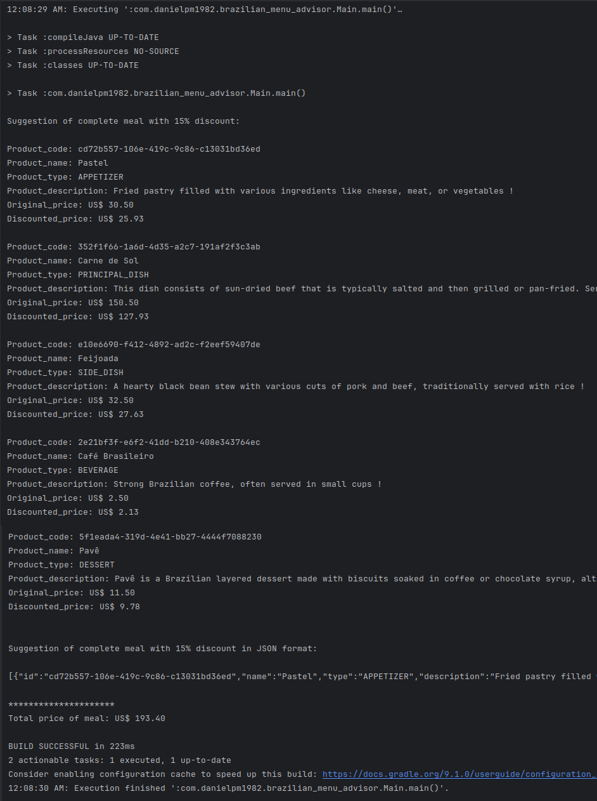

# brazilian-menu-advisor
This is a simple Java 25 console app repo that exemplifies how to use Gradle - instead of Maven - to import dependencies to a project

© 2025 Daniel Pinheiro Maia All Rights Reserved 
(see Copyright© License at the end of this text).

[**Description of this repository**] 
This is a simple Java 25 console app repo that exemplifies how to use Gradle - instead of Maven - to import dependencies to a project. The package Google Gson, from Central Maven repository, is imported and integrated to this project using Gradle. When run, this project suggests some random meal items from a sample internal in-memory DB, one meal of each type, containing only brazilian food. The meal types are: APPETIZER, PRINCIPAL_DISH, SIDE_DISH, BEVERAGE and DESSERT. At the end of execution, the suggested randomly-combined set of meal is shown, along with each item properties and total price, both in String as in JSON format, proving that the Gson dependency was imported and worked successfully.

[**Content and Run**] 
Source code available at github.com, through the following link: 
[https://github.com/danielpm1982/brazilian-menu-advisor](https://github.com/danielpm1982/brazilian-menu-advisor) 

The Gson sample package has been imported as suggested in
[https://mvnrepository.com/artifact/com.google.code.gson/gson/2.13.2](https://mvnrepository.com/artifact/com.google.code.gson/gson/2.13.2)
by choosing the Gradle tab, Compile scope and Groovy Short format config declaration.
The declaration was then copied to the build.gradle file, at the project root path.

You can clone this project into you local filesystem and, at the project root path, ask Gradle to run the project as follows (on Linux or Mac):
- for showing all dependencies (scopes: compile, test, provided, runtime): 
  ./gradlew dependencies
- for showing all compile-scoped dependencies: 
  ./gradlew dependencies --configuration runtimeClasspath
- for building the project: 
  ./gradlew clean
  ./gradlew build
- for running the project: 
  ./gradlew run

\* if on Windows, you'd have to use gradlew.bat command, instead.

More about Gradle at: 
https://gradle.org

[**Printscreen samples**] 

[**Support**] 
If you have any suggestion or correction about the content of this repository, please, feel free to open an issue at the project issues' section: 
https://github.com/danielpm1982/brazilian-menu-advisor/issues

[**Copyright© License**] 
© 2025 Daniel Pinheiro Maia All Rights Reserved 
This GitHub repository - and all code (software) available inside - is exclusively for academic and individual learning purposes, and is **NOT AVAILABLE FOR COMMERCIAL USE**, nor has warranty of any type. You're authorized to fork, clone, run, test, modify, branch and merge it, at your own risk and using your own GitHub account, for individual learning purposes only, but you're **NOT ALLOWED to distribute, sublicense and/or sell copies of the whole or of parts of it** without explicit and written consent from its owner / author. You can fork this repository to your individual account at GitHub, clone it to your personal notebook or PC, analyse, run and test its code, modify and extend it locally or remotely (exclusively at your own GitHub account and as a forked repository), as well as send issues or pull-requests to this parent (original) repository for eventual approval. GitHub is in charge of explicitly showing whom this respository has been forked from. **If you wish to use any of this repository content in any way other than what is expressed above, or publish it anyway or anywhere other than as a forked repository at your own GitHub account, please contact this repository owner / author** using GitHub or the contact info below. For the meaning of the technical terms used at this license, please refer to GitHub documentation, at https://help.github.com/en/github .

[**Owner and Author of this GitHub Repository**] 
Daniel Pinheiro Maia 
[danielpm1982.com](https://www.danielpm1982.com) 
danielpm1982@gmail.com 
[linkedin.com/in/danielpm1982](https://www.linkedin.com/in/danielpm1982) 
Brazil 
.
